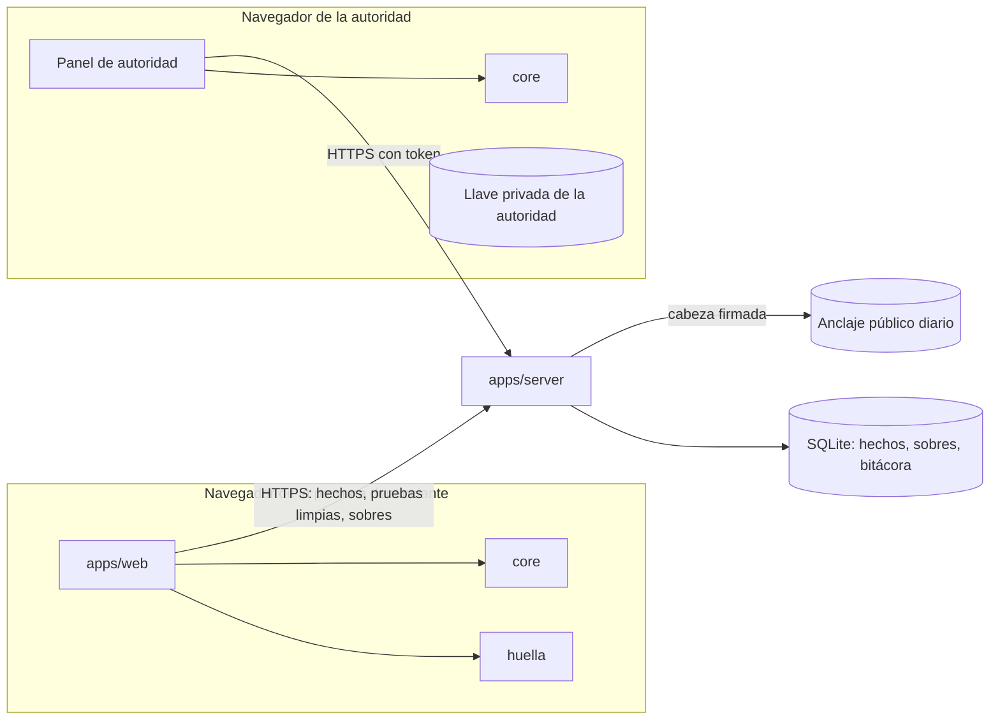
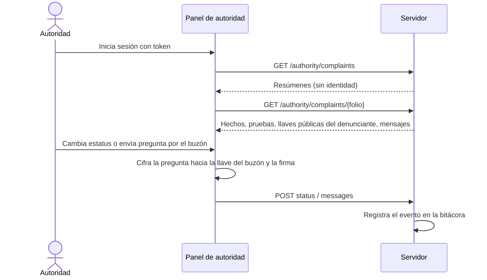
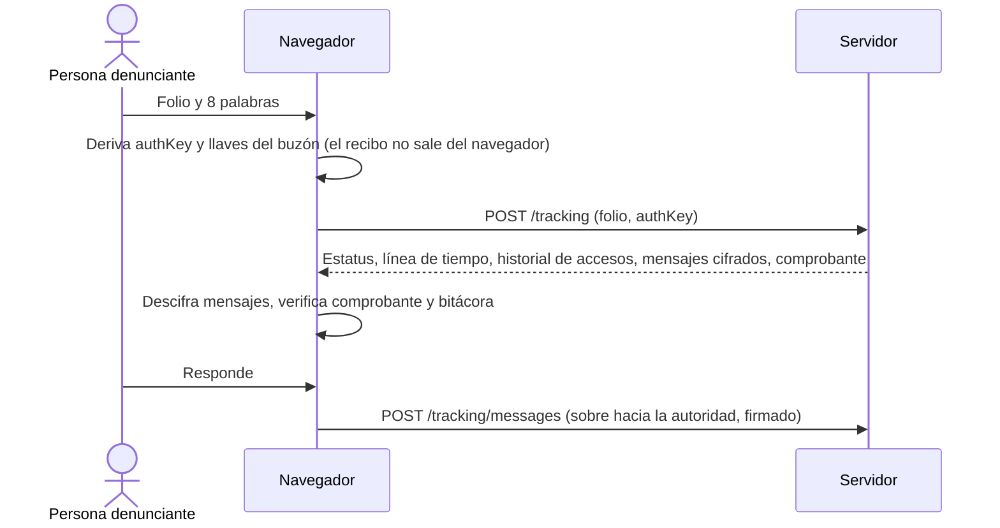
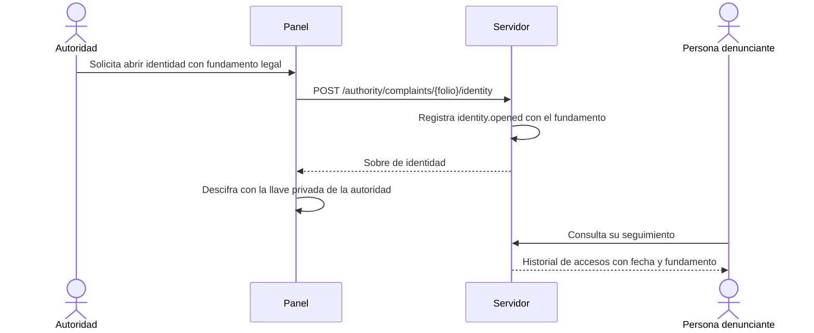

# Arquitectura

SIGILO es una capa de anonimato para un sistema de denuncias. Todo lo que puede identificar a la
persona denunciante se procesa en su navegador; el servidor almacena hechos, sobres cifrados y una
bitácora, y no puede leer identidades.

## Componentes

| Componente               | Ubicación            | Responsabilidad                                                                |
| ------------------------ | -------------------- | ------------------------------------------------------------------------------ |
| Contratos                | `packages/contracts` | Esquemas zod y rutas de la API v1. Fuente única de verdad.                     |
| Núcleo criptográfico     | `packages/core`      | HPKE, Ed25519, recibo, derivación de llaves, comprobante, bitácora.            |
| Huella Cero              | `packages/huella`    | Limpieza de pruebas, marcas invisibles, revisión de texto, semáforo de riesgo. |
| Servidor de referencia   | `apps/server`        | API v1 sobre Hono y `node:sqlite`. Valida, almacena y registra.                |
| Aplicación de referencia | `apps/web`           | Denuncia, seguimiento, panel de autoridad y datos abiertos.                    |



## Fronteras de confianza

1. **Navegador de la persona denunciante.** Zona de confianza. Aquí se genera el recibo, se derivan
   las llaves, se limpian las pruebas y se cifra la identidad.
2. **Red y servidor.** Zona no confiable para la identidad. El servidor recibe solo lo necesario para
   el trámite y no conserva direcciones IP.
3. **Navegador de la autoridad.** Zona de confianza para la llave privada de la autoridad. La
   identidad sellada solo se descifra ahí, y solo después de una solicitud registrada.
4. **Anclaje externo.** La cabeza de la bitácora se publica fuera del servidor para que no pueda
   reescribirse sin ser detectado.

## Qué ve cada actor

| Dato                                          | Persona denunciante  | Servidor y operación         | Autoridad competente                                 | Público                                    |
| --------------------------------------------- | -------------------- | ---------------------------- | ---------------------------------------------------- | ------------------------------------------ |
| Hechos (descripción, ente, conducta, periodo) | Sí                   | Sí                           | Sí                                                   | No                                         |
| Pruebas limpias                               | Sí                   | Sí                           | Sí                                                   | No                                         |
| Pruebas originales                            | Solo en su navegador | No                           | No (solo su digesto, dentro de la identidad sellada) | No                                         |
| Identidad (modo `sealed`)                     | Sí                   | Solo texto cifrado           | Sí, tras solicitud con fundamento registrada         | No                                         |
| Recibo de 8 palabras                          | Sí                   | No (solo `SHA-256(authKey)`) | No                                                   | No                                         |
| Mensajes del buzón                            | Sí                   | Solo texto cifrado           | Sí                                                   | No                                         |
| Folio                                         | Sí                   | Sí                           | Sí                                                   | No (la bitácora pública usa `folioDigest`) |
| Estadísticas agregadas                        | Sí                   | Sí                           | Sí                                                   | Sí, con supresión de celdas menores a 5    |

## Flujos por etapa

### Recepción

```mermaid
sequenceDiagram
  actor D as Persona denunciante
  participant W as Navegador (web + huella + core)
  participant S as Servidor
  D->>W: Escribe hechos y adjunta pruebas
  W->>W: Limpia pruebas, elimina marcas invisibles, revisa el texto
  W->>D: Semáforo de riesgo y vista "Así te verá la autoridad"
  W->>S: POST /evidence (imágenes limpias)
  S-->>W: evidenceId, sha256
  W->>W: Genera recibo, deriva authKey y llaves del buzón
  W->>W: (modo sealed) Cifra la identidad con HPKE hacia la autoridad
  W->>S: POST /complaints (hechos, sobre, llaves públicas, authVerifier)
  S->>S: Genera folio, registra complaint.received en la bitácora
  S-->>W: folio y comprobante firmado
  W->>D: Muestra folio y recibo; pide confirmar dos palabras
```

### Trámite



### Seguimiento



Las credenciales inválidas y los folios inexistentes producen la misma respuesta.

### Apertura de identidad



El servidor solo entrega el sobre de identidad a través de esta ruta, que siempre registra el evento.
Los listados y el detalle nunca lo incluyen.

## Bitácora

Cada evento (`complaint.received`, `complaint.status_changed`, `identity.opened`, `message.sent`)
se encadena con el hash del anterior. El servidor firma la cabeza y la publica diariamente fuera del
sistema. Ver [criptografia.md](criptografia.md).

## Despliegue

- Un solo origen sirve la aplicación y la API; no hay peticiones a terceros.
- Cabeceras: `Content-Security-Policy` estricta, `Cache-Control: no-store` en rutas sensibles,
  `Referrer-Policy: no-referrer`.
- Los registros de acceso no guardan direcciones IP.
- Las llaves privadas viven en `apps/server/data/` y no se versionan.
