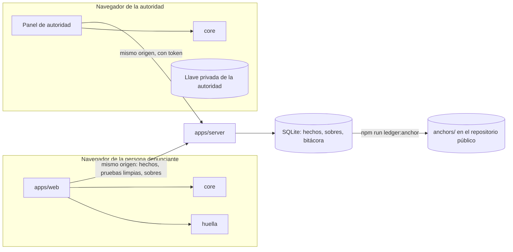
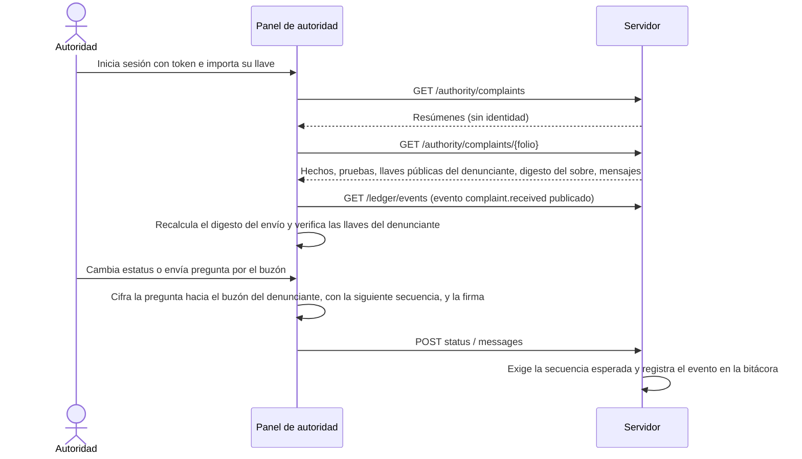
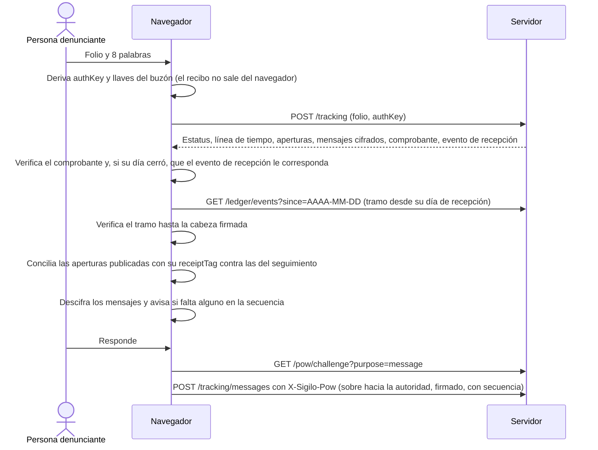
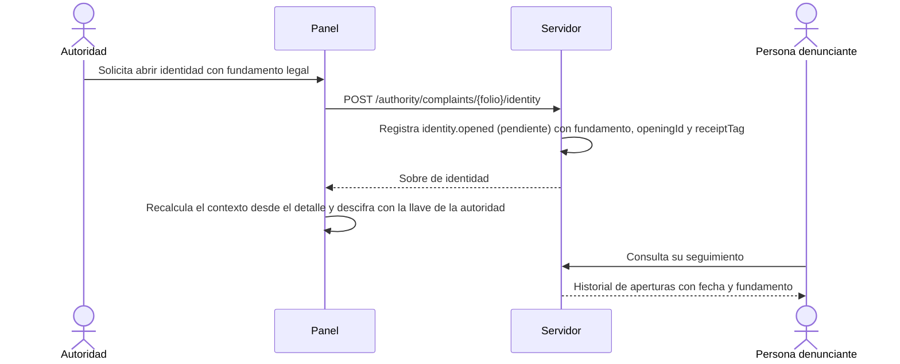

# Arquitectura

SIGILO es una capa de anonimato para un sistema de denuncias. Todo lo que puede identificar a la
persona denunciante se procesa en su navegador; el servidor almacena hechos, sobres cifrados y una
bitácora, y no puede leer identidades.

## Componentes

| Componente               | Ubicación            | Responsabilidad                                                                |
| ------------------------ | -------------------- | ------------------------------------------------------------------------------ |
| Contratos                | `packages/contracts` | Esquemas zod, catálogos y rutas de la API v1. Fuente única de verdad.          |
| Núcleo criptográfico     | `packages/core`      | HPKE, Ed25519, recibo, derivación de llaves, comprobante, buzón, bitácora.     |
| Huella Cero              | `packages/huella`    | Limpieza de pruebas, marcas invisibles, revisión de texto, semáforo de riesgo. |
| Servidor de referencia   | `apps/server`        | API v1 sobre Hono y `node:sqlite`. Valida, almacena, registra y sirve la web.  |
| Aplicación de referencia | `apps/web`           | Denuncia, seguimiento, panel de autoridad, datos abiertos y verificación.      |
| Scripts                  | `scripts/`           | Llaves de demostración, anclaje de la bitácora y reinicio de la demostración.  |



## Fronteras de confianza

1. **Navegador de la persona denunciante.** Zona de confianza. Aquí se genera el recibo, se derivan
   las llaves, se limpian las pruebas, se eliminan las marcas invisibles y se cifra la identidad.
2. **Red y servidor.** Zona no confiable para la identidad. El servidor recibe solo lo necesario para
   el trámite y no registra direcciones IP. Sí entrega el código de la web: un servidor
   comprometido puede alterarlo (ver `modelo-de-amenazas.md`, C03 y D03).
3. **Navegador de la autoridad.** Zona de confianza para la llave privada de la autoridad, que se
   importa en memoria. La identidad sellada solo se descifra ahí, después de una solicitud
   registrada.
4. **Anclaje externo.** La operación ejecuta `npm run ledger:anchor`, que escribe la cabeza pública
   firmada en `anchors/AAAA-MM-DD.json`, y versiona el archivo en el repositorio público. Cualquier
   persona puede comparar la bitácora contra esas anclas en `/verificar`.

## Qué ve cada actor

| Dato                                          | Persona denunciante  | Servidor y operación         | Autoridad competente                                 | Público                                                                                           |
| --------------------------------------------- | -------------------- | ---------------------------- | ---------------------------------------------------- | ------------------------------------------------------------------------------------------------- |
| Hechos (descripción, ente, conducta, periodo) | Sí                   | Sí                           | Sí                                                   | No                                                                                                |
| Pruebas limpias                               | Sí                   | Sí                           | Sí                                                   | No                                                                                                |
| Pruebas originales                            | Solo en su navegador | No                           | No (solo su digesto, dentro de la identidad sellada) | No                                                                                                |
| Identidad (modo `sealed`)                     | Sí                   | Solo texto cifrado           | Sí, tras solicitud con fundamento registrada         | No                                                                                                |
| Recibo de 8 palabras                          | Sí                   | No (solo `SHA-256(authKey)`) | No                                                   | No                                                                                                |
| Mensajes del buzón                            | Sí                   | Solo texto cifrado           | Sí                                                   | No                                                                                                |
| Folio                                         | Sí                   | Sí                           | Sí                                                   | No (la bitácora pública usa `folioDigest`)                                                        |
| Eventos de la bitácora                        | Los de su denuncia   | Todos                        | Todos                                                | Solo los de días cerrados, barajados, con `folioDigest`                                           |
| Estadísticas agregadas                        | Sí                   | Sí                           | Sí                                                   | Meses congelados, redondeo aleatorio a múltiplos de 5, celdas que redondean a menos de 5 omitidas |

## Flujos por etapa

### Recepción

```mermaid
sequenceDiagram
  actor D as Persona denunciante
  participant W as Navegador (web + huella + core)
  participant S as Servidor
  D->>W: Escribe hechos y adjunta pruebas
  W->>W: Limpia pruebas, elimina marcas invisibles, revisa el texto
  W->>D: Semáforo de riesgo y vista «Así te verá la autoridad»
  W->>S: GET /keys (compara con las llaves fijadas; si difieren, no envía nada)
  W->>S: GET /pow/challenge (reto de un solo uso)
  W->>W: Resuelve la prueba de trabajo en un Web Worker
  W->>S: POST /evidence con X-Sigilo-Pow (solo imágenes limpias y verificadas)
  S-->>W: evidenceId, sha256
  W->>W: Genera recibo, deriva authKey y llaves del buzón
  W->>W: (modo sealed) Cifra la identidad con HPKE hacia la autoridad
  W->>S: POST /complaints con X-Sigilo-Pow (hechos, sobre, llaves públicas, authVerifier)
  S->>S: Valida catálogos, genera folio, deja complaint.received pendiente
  S-->>W: folio y comprobante firmado
  W->>D: Muestra folio y recibo; pide confirmar dos palabras
```

El sobre de identidad se cifra con un AAD que incluye `authVerifier`, las llaves públicas de la
persona denunciante y `contentDigest` (digesto de los hechos, las pruebas, el modo y la solicitud
de protección). Así no puede moverse a otra denuncia. Ver [criptografia.md](criptografia.md).

### Trámite



### Seguimiento



- Las credenciales inválidas y los folios inexistentes producen la misma respuesta.
- El estado de publicación del evento de recepción se muestra en lenguaje claro: pendiente de
  publicar, ya publicado o, si no coincide, un aviso de que el sistema podría mostrar cosas distintas
  a cada persona.
- Si la bitácora publicada tiene una apertura con su `receiptTag` que el seguimiento no muestra, o
  el seguimiento muestra una de un día publicado que no está en la bitácora, se avisa.
- Solo los fallos de autenticación consumen el límite por folio; los mensajes tienen su propio
  límite.

### Apertura de identidad



El servidor solo entrega el sobre de identidad a través de esta ruta, que siempre registra el evento.
Los listados y el detalle nunca lo incluyen. Es un control de política: quien tenga la llave de la
autoridad y una copia de la base puede descifrar sin pasar por la ruta.

## Bitácora

- Cada evento (`complaint.received`, `complaint.status_changed`, `identity.opened`, `message.sent`,
  `evidence.discarded`) se encadena con el hash del anterior. Triggers de SQLite impiden modificar o borrar eventos.
- **Cierre diario barajado.** Un evento nuevo queda pendiente, sin `seq`, con una fecha que nunca
  es anterior a la del último evento. Una tarea programada (cada 10 minutos; las lecturas no
  publican) baraja los pendientes de cada día cerrado (UTC) con aleatoriedad criptográfica y los
  encadena en lotes de 1000, sin bloquear el servidor. La cabeza
  pública es la del último evento encadenado; un día está publicado si y solo si `at <= head.at`.
  Así ni la hora ni el orden de llegada se pueden deducir de la bitácora.
- **Etiqueta del recibo.** `identity.opened` lleva `receiptTag`, derivado del `authVerifier`, para que
  la persona denunciante encuentre sus aperturas aunque se registren con otro folio.
- **Anclaje.** `ledger:anchor` verifica la cabeza pública con la llave fijada, recalcula la cadena
  desde la ancla anterior (o el génesis) y escribe `anchors/AAAA-MM-DD.json`. La forma preferida es
  leer la API pública (`SIGILO_ANCHOR_URL`); sin ella lee la base local en solo lectura.
- **Verificación.** `/verificar` descarga la bitácora pública, comprueba la cadena y la cabeza
  firmada, y permite pegar un ancla para comprobar que la cadena contiene ese `seq` y ese hash.

Ver [criptografia.md](criptografia.md).

## Despliegue

- **Un solo origen.** En desarrollo, el proxy de Vite sirve web y API desde `127.0.0.1:5173`. En
  despliegue, `SIGILO_WEB_DIST` hace que el servidor entregue `apps/web/dist` con respaldo de SPA a
  `index.html`. CORS está desactivado salvo que `SIGILO_ALLOWED_ORIGIN` lo configure.
- **Cabeceras de la web:** CSP como cabecera con `frame-ancestors 'none'`, `X-Frame-Options: DENY`,
  `Referrer-Policy: no-referrer`, `nosniff`, `Cache-Control: no-store` y
  `Strict-Transport-Security` cuando se define `SIGILO_HSTS_MAX_AGE`.
- **Cabeceras de la API:** `Content-Security-Policy: default-src 'none'`, `no-store` y `nosniff`.
- **Sin terceros.** La web no hace peticiones fuera de su origen; una prueba E2E lo comprueba.
- **Historial.** La web usa un router en memoria: no deja rutas ni entradas nuevas en el historial.
- **Abuso.** Prueba de trabajo adaptativa (`SIGILO_POW_BITS`, 18; `SIGILO_POW_MAX_BITS`, 20): un
  reto por denuncia con sus pruebas y otro por mensaje. Límites en memoria con tope LRU (fallos de
  autenticación y mensajes por folio), sin frenos globales de escrituras. Cuota total de pruebas con
  tope por denuncia (`SIGILO_EVIDENCE_QUOTA_BYTES`; si no cabe, `507 storage_full`, sin borrar
  pruebas asociadas), retención de pruebas de denuncias sin atender o archivadas
  (`SIGILO_EVIDENCE_RETENTION_DAYS`), descarte de pruebas por la autoridad (queda en la bitácora y
  en el seguimiento), purga de las pendientes de retos vencidos y tope de pendientes por día en la bitácora, del que están
  exentos los eventos de la autoridad.
- **Almacenamiento.** Tablas privadas `WITHOUT ROWID`, `secure_delete` y checkpoint del WAL tras cada
  cierre diario, para que una copia de la base no conserve el orden de llegada.
- **Registros.** Por omisión, contadores agregados por hora sin las rutas de la persona denunciante
  ni `GET keys` y la bitácora (`SIGILO_REQUEST_LOG=aggregate`); nunca IP, agente de usuario, cuerpos
  ni folios.
- **Un solo servidor por base.** `server.lock` en el directorio de datos, creado con `wx` y
  renovado cada 10 minutos.
- **Llaves.** Las llaves privadas viven en `apps/server/data/` y no se versionan. Las públicas se
  fijan en `apps/web/src/config/pinned-keys.json`.
- **Reloj de pruebas.** `SIGILO_TEST_CLOCK_FILE` desplaza el reloj del servidor solo en pruebas
  (`SIGILO_E2E=1` o `NODE_ENV=test`), con un archivo propio no escribible por otros y un desfase de
  0 a 400 días.
